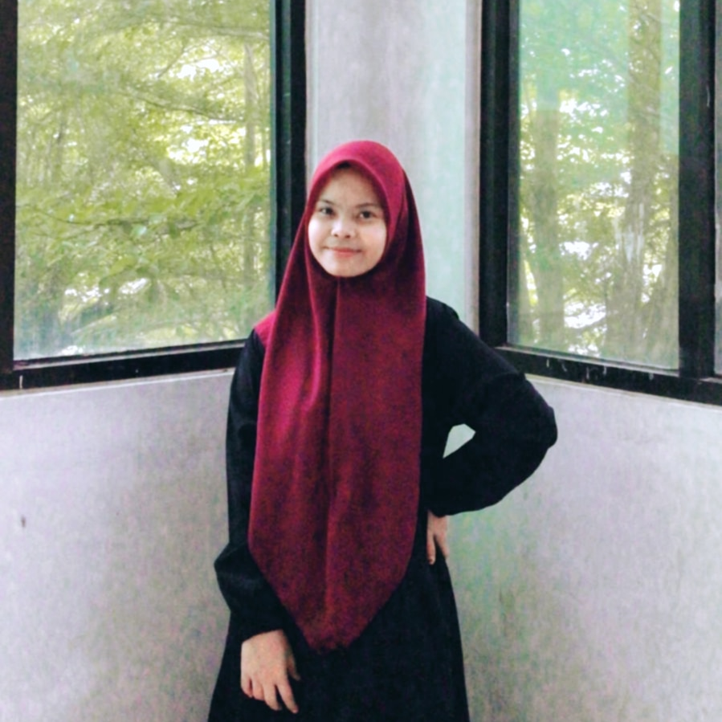
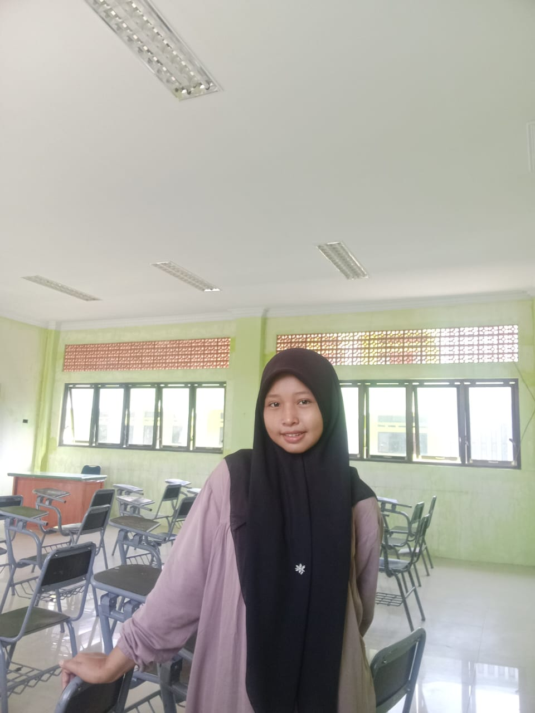

<html lang="id">
<head>
  <meta charset="UTF-8" />
  <meta name="viewport" content="width=device-width, initial-scale=1.0" />
  <title>NextGen Bimbel</title>
  
</head>
<body>

  <header class="header">
    

      
NextGenBimbel

      <nav class="nav">
        <a href="#">Beranda</a>
        <a href="#">Tentang Kami</a>
        <a href="#">Program</a>
        <a href="#">Testimoni</a>
        <a href="#">Kontak</a>
      </nav>
    

  </header>

  <section class="hero">
    

      <h1>Solusi Belajar Terbaik untuk Masa Depan Cemerlang</h1>
      
Gabung bersama ribuan pelajar sukses bersama NextGen Bimbel.

      <a href="#" class="btn">Daftar Sekarang</a>
    

  </section>

  <section class="programs">
    

      <h2>Program Unggulan</h2>
      

        

          <h3>Kelas Intensif UTBK</h3>
          
Persiapan masuk PTN favorit dengan materi terfokus & try out rutin.

        

        

          <h3>Les Privat</h3>
          
Belajar 1-on-1 sesuai gaya belajar dan kebutuhan kamu.

        

        

          <h3>Kelas Reguler SMP/SMA</h3>
          
Pendalaman materi sekolah sesuai kurikulum terbaru.

        

      

    

  </section>

  <section class="testimonial">
    

      <h2>Apa Kata Mereka?</h2>
      

        

          
“Aku jadi ranking 1 di sekolah setelah ikut NextGen. Materinya mudah dipahami banget!”

          - Nisa, Kelas 9
        

        

          
“NextGen bantu aku lolos SBMPTN! Sistem belajarnya bener-bener beda dan efektif.”

          - Ardi, Alumni 2024
        

      

    

  </section>

  <!-- Tutors Section -->
  <section id="tutors" class="tutors-section">
    

      

        
Tim Pengajar

        <h2>Pengajar Berpengalaman</h2>
        
Kami bekerja sama dengan guru-guru terbaik dari berbagai bidang pelajaran untuk memastikan siswa mendapatkan pembelajaran berkualitas.

      

      

        

          
          
Nur Hasanah Hasibuan

        

        

          
          
Nia Ramadhani

        

      

    

  </section>

  <!-- Contact & Footer -->
  <footer id="contact">
    

      <section class="footer-section">
        <h3>NextGen Bimbel</h3>
        
Platform bimbingan belajar online yang membantu kamu meraih impian akademikmu!

      </section>
      <section class="footer-section">
        <h3>Tentang Kami</h3>
        
NextGen Bimbel hadir dengan semangat meningkatkan kualitas pendidikan Indonesia melalui metode pembelajaran yang inovatif.

      </section>
      <section class="footer-section">
        <h3>Kontak</h3>
        
Jl. Pendidikan No. 134, Sihitang

        
Kode Pos: 55281

      </section>
      <section class="footer-section">
        <h3>Sosial Media</h3>
        
<strong>YouTube:</strong> NextGen Bimbel Official

      </section>
    

    

      
&copy; 2025. <b>NextGen Bimbel</b> All Rights Reserved.

    

  </footer>
</body>
</html>
